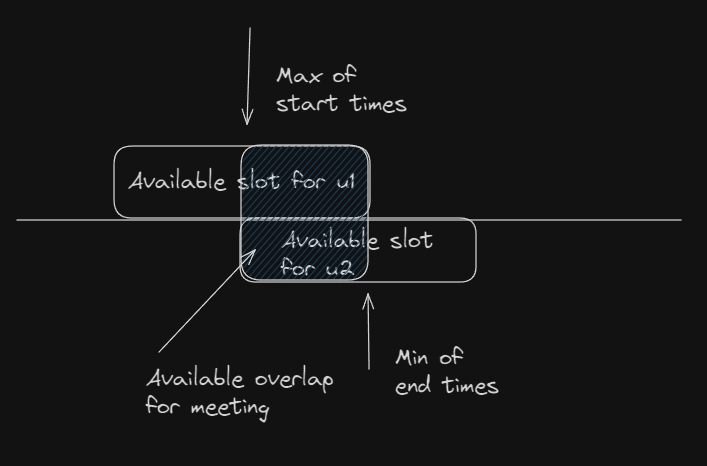
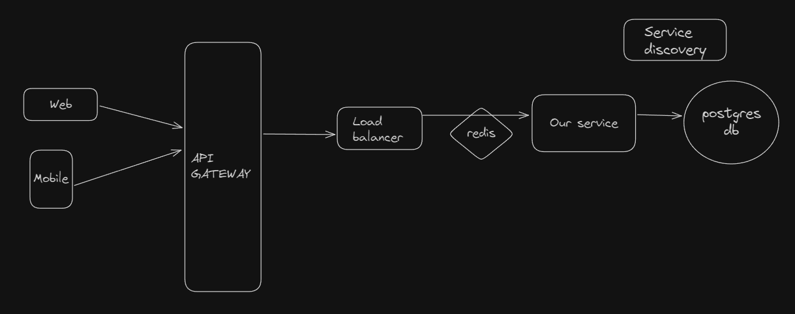

# Introduction
----
## Problem brief
----
The assignment wants us to create REST APIs for an app like calendly. 3 basic APIs required are
1. Setting own availability
2. Showing own availability
3. Finding overlap in schedule between 2 users
## Ideation
----
To understand more about what all we can support, we look at calendly itself. When you go to book an appointment, you can choose dates and time zone while the meeting size and appointment timings are already marked as per availability. To support a frontend like this, we should be able to handle time as per time zones and find available slots to show for booking when a date is chosen.

##### 1. Assumptions
----
- Checking availability for a user is a more frequently called API than booking
    - This means our system will be read-heavy overall with major contributions coming from this API.
    - Solution: To mitigate this we can have a cache (ex, Redis) for our availability API. We mark the entry invalid manually when we receive a write for some user. <userId, day> being the obvious choice for key of the cache.
- The connections used in this application are http connections and https. For https we would need self signed SSL certificates. Also, sending username and password combination in a post body request across an https connection is a standard practice.
- We are passing userId in the POST request body or GET parameters for sake of simplicity. If this application has to be deployed in a production setting, we would do the user authentication using JWT (also have refresh_token to force drop all tokens for hard times) as forging a request with userId is simple here.
- We will be using a single Redis instance and will NOT be sharding our Postgres. With consistent hashing and service discovery tool like Zookeeper we should be able to do both.
- The application is created using Java 17. We are using docker to host all our services.
- Users can create a profile but can only change passwords after the profile is set. Updates to other fields are not permitted. Some fields like username and email should anyways not be permitted to change by design. Others like working hours for sake of simplicity are set at the time of profile creating, otherwise writing a CRUD of users would be the way to go.

##### 2. Approaching the problem inverted
----
For a user of this application, they most likely will be syncing their current calendar with our app as maintaining 2 calendar is something no user would want to do, which will drive customers away from your app. Keeping this in mind, rather than making a support for availability, I have exposed something called as `MarkUnavailability`. This API can be called by some cronjob or listener to user's other calendar application, marking an event at our backend for those busy time.
A natural question to ask would be, how are we supporting availability and sessions then? For simplicity, I have assumed that users mark their working hours and taking the compliment of all the events from these working hours with the preferred session length, we can get available sessions.
Another question comes then, would a user keep changing working hours everyday? The user here will mark unavailable times from their calendar, when they don't wish to work. This is counter-intuitive and drive customers away. I would ideally want to support marking availability as well. But for the sake of time, let's think as the user would mark unavailability the same way they would have marked availability. In short, I understand that to keep business, we need to make it intuitive and also support marking availability.
##### 3. Why calculating availability on the fly is fine?
----
The minimum duration of a meetup as of now is set to 15 mins. Assuming we have 12 hours marked as working hours, we will have 4 sessions per hour, making 48 sessions per day for a particular user. Calculating the compliment would mean $48 - x$ sessions, where $x$ are the booked sessions. That's not too much for now (as the user base is small for MVP).

#### 4. Taking time in seconds vs milliseconds
----
We can shave off our space, thereby saving money by taking seconds instead of milliseconds. In a world where the minimum meetup time is 15 minutes, milliseconds offer no value. The same argument can hold for minutes, but we are dealing with epoch timestamp in seconds here.

##### 5. Postgres vs MongoDB?
----
**a. Postgres**

As calculated in the previous section, per day for a user we can have 48 sessions. Assuming a healthy amount of users before we re-architect, let's take 1 million users. We will have 48 M sessions per day for our user base. Assuming 100 Bytes per DB entry, that is $48 * 10^8 \text{ bytes} \rightarrow 4.8 * 10^9 \text{ bytes}$ which is 4.8 GB worth of data daily. Assuming we only book for 2 months in advance, we can have maximum of 288 GB worth of data for all customers. Although, systems can handle this much data, but our queries will be significantly slower. To mitigate this, we will shard the events/sessions data on userId. Also, once the events of today happen, we no longer need them in a hot storage, so let's run a cronjob which migrates all the events that happen more than 24 hours ago to our data warehouse. This will keep our databases light and faster running. We often run into celebrity problems when we shard, so we can re-shard and isolate the user if something like that happens. Since the system is read-heavy, having indices on event starting time will give us an edge. Also, all this load is manageable using sharding.

**b. MongoDB**

To model the events associated with a user with user data itself seems like a good data choice. Querying and filtering will require us pulling a single document. However, keeping all the past events in the hot store is not advisable. So we need to have some heavy writes, where we push past event to cold store and then make a new write. The alternate to that would be to scan the db for all users and getting past events from them and pushing to cold store. Writes will be fast for a NoSQL DB and since reading happens from a single document with this cold storage push, each document should be light enough to pull fast. Data estimates will be similar.

Verdict
For low user numbers and our current feature set, it doesn't really matter. So in favor of more experience with relational databases, I chose Postgres here.

##### 6. Calculating overlap
----


## Basic design
----


## Follow-up features
1. Booking should be able to invite multiple users added apart from owner and attendee, for which we already have a metadata converter.
2. Meeting link can be set to some default, so we can push with the same meeting link atleast. Have a field for that in our schema.
3. Allow overlap findings between multiple users. Show availability as well as their blocked calendars.
4. Balance timezone difference between meetings. Already setup most of the code but need to weed out corner cases using tests.

## Postman collection available [here](xyz.harbor.calendly.postman_collection.json)
----
## Running server
----
```
docker-compose -f compose.yml up -d --build
```
The server will be up at `http://localhost:8080`
